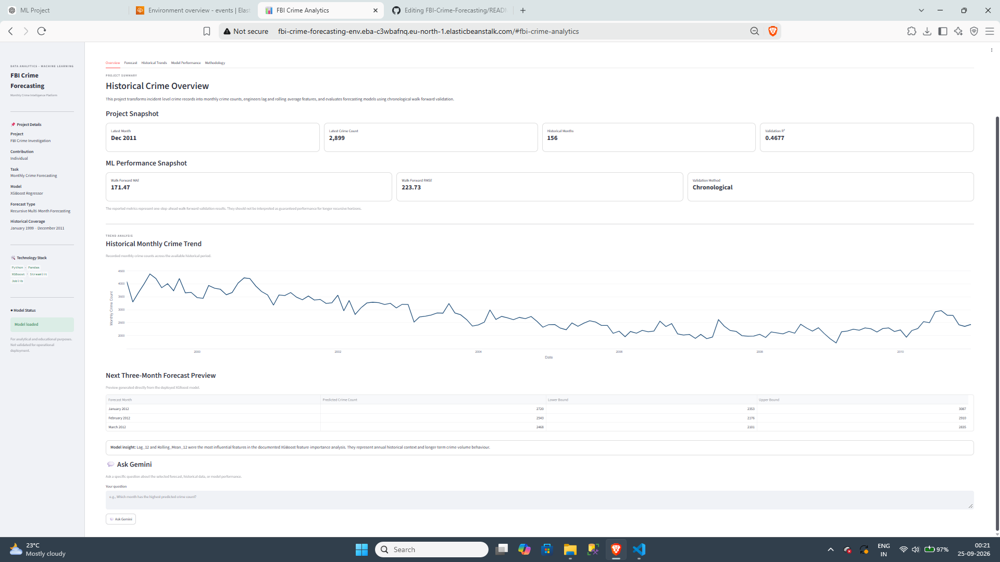
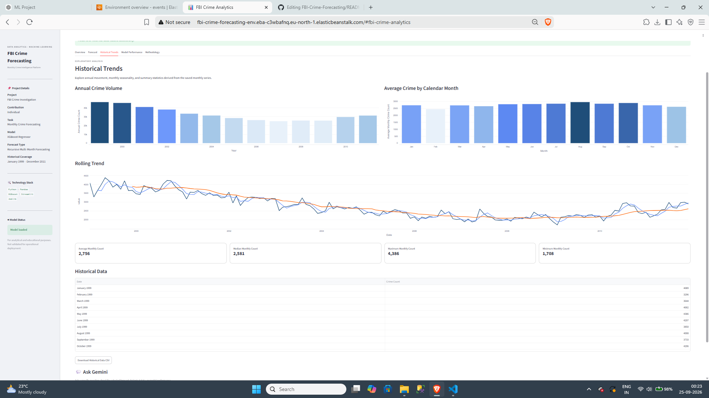
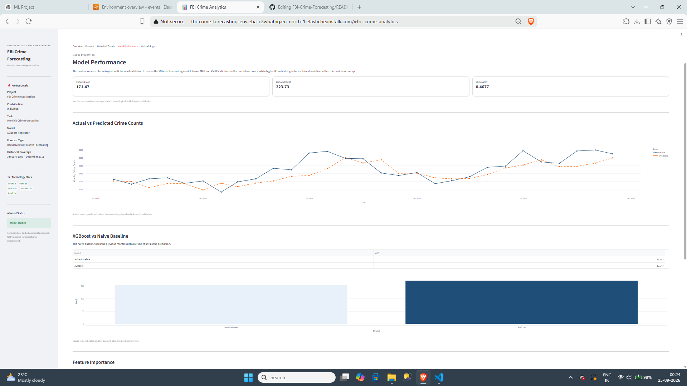

# FBI Crime Investigation & Monthly Crime Prediction


## Live Demo

**AWS Elastic Beanstalk:**  
http://fbi-crime-forecasting-env.eba-c3wbafnq.eu-north-1.elasticbeanstalk.com/

**GitHub Repository:**  
[github.com/Mukul703/FBI-Crime-Forecasting](https://github.com/Mukul703/FBI-Crime-Forecasting)

---

## Project Overview

**FBI Crime Investigation & Monthly Crime Prediction** is an end-to-end machine learning project that converts incident-level crime records into a monthly crime-volume forecasting workflow.

The project combines:

- Data cleaning and validation
- Exploratory data analysis (EDA)
- Statistical hypothesis testing
- Monthly time-series aggregation
- Lag and rolling-window feature engineering
- Regression and time-series model evaluation
- Chronological walk-forward validation
- XGBoost forecasting
- SHAP-based model explainability
- Streamlit interactive analytics
- Google Gemini-powered forecast interpretation
- AWS Elastic Beanstalk deployment

The deployed application is intended for **analytical and educational use**. The current forecasting model should not be treated as a validated operational crime-prediction system.

---

## Problem Statement

The original dataset contains **474,565 incident records across 13 variables**, including crime type, approximate street block, neighbourhood, coordinates, hour, minute, year, month, day, and date.

At the incident level, these records contain detailed temporal and spatial information, but the forecasting objective requires a consistent monthly target. The project therefore addresses a specific analytical problem:

> **How can incident-level historical crime records be transformed into a monthly time series and used to estimate future monthly crime volume from previously observed crime patterns?**

The forecasting workflow aggregates incidents by year and month, creates historical lag and rolling-average features, and evaluates models using chronological validation rather than randomly shuffling the time series.

The project also includes EDA and statistical analysis to examine how crime patterns vary across time, geography, crime type, and time of day.

---

## Analytical Objective

The project has two connected objectives:

1. **Understand historical crime patterns** through data preprocessing, EDA, visual analysis, and statistical testing.
2. **Forecast monthly total crime volume** using historical monthly counts and time-series features.

The deployed forecasting target is **total monthly crime count**. It does **not** generate separate forecasts for individual crime categories.

---

## Dataset

### Dataset Characteristics

| Attribute | Details |
|---|---|
| Initial records | 474,565 |
| Variables | 13 |
| Duplicate records removed | 44,618 |
| Final records after wrangling | 429,947 |
| Historical coverage | 1999–2011 |
| Forecasting frequency | Monthly |
| Monthly observations | 156 |
| Forecast target | Total monthly crime incidents |

### Variables

The source dataset contains:

- `TYPE` — reported crime type/category
- `HUNDRED_BLOCK` — approximate incident street block
- `NEIGHBOURHOOD` — associated neighbourhood
- `X`, `Y` — geographic coordinates
- `Latitude`, `Longitude` — geographic coordinates
- `HOUR`, `MINUTE` — incident time
- `YEAR`, `MONTH`, `DAY` — date components
- `Date` — incident date

### Data Preprocessing

The preprocessing workflow includes:

- Removing **44,618 exact duplicate records**
- Replacing missing `HUNDRED_BLOCK` and `NEIGHBOURHOOD` values with `Unknown`
- Representing missing `HOUR` and `MINUTE` values with `-1`
- Converting `Date` to datetime format
- Validating year, month, day, hour, and minute ranges
- Checking latitude and longitude validity
- Retaining the cleaned dataset with **429,947 records**

---

## Exploratory Data Analysis

EDA was performed before forecasting to understand the structure and variation of the crime data.

The analysis examined:

- Yearly and monthly crime trends
- Crime patterns by hour and time of day
- Crime-type distributions
- Neighbourhood-level patterns
- Temporal and spatial variation
- Distributional patterns using box plots
- Pareto-style analysis
- Heatmaps and other visual summaries

The notebook also includes statistical hypothesis testing using:

- **Mann–Whitney U test** to compare monthly crime volumes across selected historical periods
- **Chi-square test of independence** to examine the relationship between crime type and time of day

These analyses describe statistical relationships in the dataset; they do not establish causal relationships.

---

## Forecasting Approach

### Monthly Aggregation

Incident records were aggregated by:

```text
YEAR + MONTH → Monthly Crime Count
```

This produced **156 monthly observations** covering January 1999 through December 2011.

### Time-Series Features

The feature-engineered forecasting dataset uses historical crime counts to construct:

| Feature | Description |
|---|---|
| `Lag_1` | Previous month's crime count |
| `Lag_2` | Crime count from two months earlier |
| `Lag_3` | Crime count from three months earlier |
| `Lag_6` | Crime count from six months earlier |
| `Lag_12` | Crime count from twelve months earlier |
| `Rolling_Mean_3` | Previous 3-month rolling mean |
| `Rolling_Mean_6` | Previous 6-month rolling mean |
| `Rolling_Mean_12` | Previous 12-month rolling mean |

Rolling features are shifted before calculation so that the current target is not used to construct its own predictors.

---

## Model Development

The notebook evaluates multiple approaches across the project:

- Linear Regression
- Random Forest Regression
- Gradient Boosting Regression
- Seasonal Naive Forecasting
- SARIMA
- Feature-engineered Random Forest
- Feature-engineered Gradient Boosting
- Feature-engineered XGBoost

The final deployed model is **XGBoost Regressor**.

### Why XGBoost Was Selected for Deployment

Among the three feature-engineered machine-learning models evaluated with one-step-ahead walk-forward validation, XGBoost produced:

- The lowest MAE
- The lowest RMSE
- The highest R²

However, the model **did not outperform the Naive Baseline** on MAE. XGBoost was retained as the deployed model because it was the strongest of the evaluated feature-engineered ML models and provides a foundation for further experimentation.

---

## Validation Strategy

Random train-test shuffling is inappropriate for this forecasting task because it can expose the model to future information.

The project therefore uses **chronological walk-forward validation** for the feature-engineered forecasting models.

For each validation step:

1. Historical observations available before the target month are used to create features.
2. The model predicts the next month.
3. The actual observed value becomes available for the following forecasting step.
4. The process continues chronologically.

This evaluates **one-step-ahead forecasting performance** and should not be interpreted as evidence of equivalent long-horizon recursive forecasting accuracy.

---

## Model Performance

Current walk-forward validation results:

| Model | MAE | RMSE | R² |
|---|---:|---:|---:|
| Gradient Boosting | 175.34 | 230.64 | 0.4343 |
| Random Forest | 173.96 | 227.48 | 0.4497 |
| **XGBoost** | **171.47** | **223.73** | **0.4677** |
| Naive Baseline | **153.97** | — | — |

### Interpretation

XGBoost is the strongest of the three feature-engineered ML models in this walk-forward evaluation.

However:

> **XGBoost MAE = 171.47 vs. Naive Baseline MAE = 153.97**

Therefore, the current XGBoost model does **not** outperform the simple naive baseline. This is an important evaluation result rather than something hidden from the project documentation.

Further feature engineering, tuning, baseline comparison, uncertainty analysis, and broader time-based validation are required before considering the model for operational use.

---

## Model Explainability

The project uses **SHAP (SHapley Additive exPlanations)** to examine feature contributions in the XGBoost model.

The SHAP analysis identified the following as influential features:

1. `Lag_12`
2. `Rolling_Mean_12`
3. `Rolling_Mean_6`
4. `Lag_1`

This indicates that the model relies substantially on historical annual patterns and longer-term crime-volume trends.

SHAP feature importance describes model behaviour; it should not be interpreted as evidence that these features causally produce changes in crime volume.

---

## Interactive Streamlit Dashboard

The deployed dashboard provides:

### Overview

- Historical monthly crime summary
- Latest available month and crime count
- Historical trend visualization
- Project and model context

### Forecast

- Selectable forecast horizon
- Recursive multi-month forecasts
- Historical context + forecast visualization
- Empirical prediction intervals based on validation errors
- Forecast results table
- CSV download
- Forecast summary and direction indicators

> The displayed prediction intervals are empirical intervals calibrated from validation errors. They are **not formal statistical confidence intervals** and do not guarantee coverage.

### Historical Trends

- Historical monthly crime-volume analysis
- Interactive trend visualization

### Model Performance

- MAE, RMSE, and R² metrics
- Walk-forward validation results
- Naive baseline comparison
- Model evaluation context

### Methodology

- Data preparation
- Feature engineering
- Forecasting methodology
- Validation approach
- Model limitations

---

## Generative AI Integration

The application integrates **Google Gemini** to provide evidence-constrained natural-language analysis of the forecasting results.

### Gemini AI Insights

The dashboard can generate a structured five-section forecast briefing covering:

1. Forecast Overview
2. Key Changes
3. Historical Context
4. Planning Considerations
5. Model Limitations

The prompt supplies the model with forecast values, recent historical data, and model-performance metrics.

The generated response is explicitly constrained to the supplied project data and is instructed not to invent:

- Causes of crime
- External factors
- Crime locations
- Specific crime categories
- Unsupported operational recommendations

### Ask Gemini

The dashboard also provides a targeted analytical Q&A interface.

Users can ask questions about:

- The selected forecast
- Recent historical monthly data
- Model performance

The response is generated from the supplied dashboard context and numerical evidence rather than unrestricted external knowledge.

The application also handles cases where the available project data is insufficient to answer the question.

---

## Deployment

The application is deployed using:

- **Streamlit**
- **AWS Elastic Beanstalk**
- **Python 3.12**
- **Amazon Linux 2023**
- **Procfile-based application startup**
- Environment variables for secrets

The Gemini API key is supplied through the AWS environment configuration and is **not stored in the repository**.

Application startup:

```text
streamlit run app/app.py --server.port $PORT --server.address 0.0.0.0
```

---

## Project Structure

```text
FBI-Crime-Forecasting/
│
├── app/
│   └── app.py
│
├── data/
│   ├── processed/
│   │   └── xgb_walk_forward_validation.csv
│   └── raw/
│
├── models/
│   ├── crime_forecasting_deployment_bundle.pkl
│   ├── final_xgb_crime_forecasting_model.joblib
│   ├── final_xgb_model.json
│   ├── historical_monthly_crime_data.pkl
│   └── xgb_model_metadata.pkl
│
├── notebooks/
│   └── FBI_Crime_Investigation_ML_Project.ipynb
│
├── src/
│   └── pipeline.py
│
├── Procfile
├── requirements.txt
├── README.md
└── LICENSE
```

---

## Technology Stack

**Data Analysis**
- Python
- Pandas
- NumPy
- Matplotlib
- Seaborn

**Machine Learning**
- Scikit-learn
- XGBoost

**Time-Series Forecasting**
- Lag features
- Rolling statistics
- Seasonal Naive
- SARIMA
- Walk-forward validation

**Model Explainability**
- SHAP

**Generative AI**
- Google Gemini API

**Application**
- Streamlit
- Plotly

**Deployment**
- AWS Elastic Beanstalk

**Development**
- Jupyter Notebook
- Joblib

---

## Limitations

The current project has several important limitations:

- XGBoost does not outperform the Naive Baseline on MAE.
- Walk-forward validation evaluates one-step-ahead predictions and does not establish long-horizon recursive accuracy.
- The forecasting target is total monthly crime volume rather than individual crime categories.
- The current model does not incorporate external variables that may affect crime patterns.
- Prediction uncertainty requires more rigorous statistical treatment.
- The available historical period is limited to 1999–2011.
- The model should not be used as a standalone operational public-safety decision system.

---

## Future Improvements

Potential next steps include:

- Systematic XGBoost hyperparameter optimization
- Additional temporal and seasonal features
- More robust baseline models
- Additional time-series models
- External contextual features where appropriate
- Multi-horizon evaluation
- Rolling-origin evaluation across multiple historical windows
- Formal prediction-interval and uncertainty methods
- Model monitoring and drift analysis
- Improved forecast calibration
- Additional explainability analysis

---

## Key Takeaways

This project demonstrates an end-to-end workflow from **raw incident-level data to a deployed forecasting application**.

The main technical workflow is:

```text
Incident Records
      ↓
Data Cleaning & Validation
      ↓
EDA + Statistical Testing
      ↓
Monthly Aggregation
      ↓
Lag + Rolling Features
      ↓
Chronological Walk-Forward Validation
      ↓
Model Comparison
      ↓
XGBoost Forecasting
      ↓
SHAP Explainability
      ↓
Streamlit Dashboard
      ↓
Gemini Analytical Assistance
      ↓
AWS Elastic Beanstalk Deployment
```

The project emphasizes not only model development, but also **validation discipline, baseline comparison, explainability, deployment, and transparent reporting of model limitations**.

---

## Disclaimer

This project is developed for **analytical, educational, and portfolio purposes**.

Forecasts are estimates derived from historical data and model assumptions. They should not be interpreted as confirmed future crime observations or used as the sole basis for public-safety, law-enforcement, staffing, or resource-allocation decisions.

---

## License

This project is licensed under the MIT License. See [`LICENSE`](LICENSE) for details.
